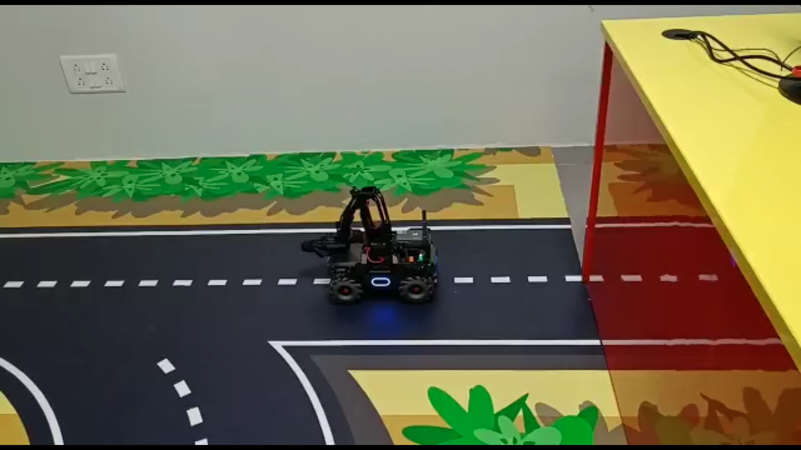
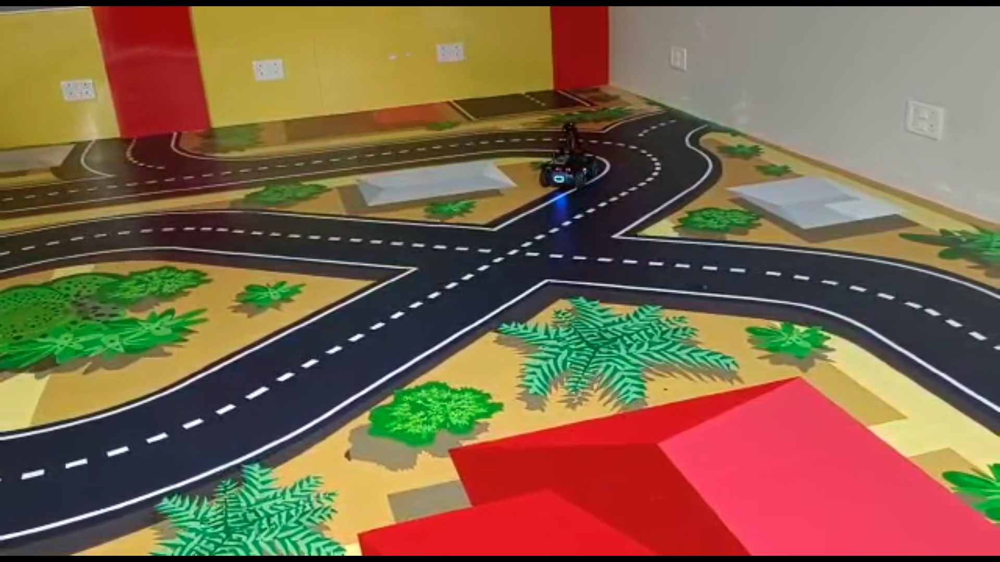

# MobileRobot-Openloopcontrol
## Aim:

To develop a python control code to move the mobilerobot along the predefined path.

## Equipments Required:
1. RoboMaster EP core
2. Python 3.7

## Procedure
### Step1:
Initiate the MobileRobot.

### Step2:
Connect your PC with the MobileRobot through Wi-Fi.

### Step3:
Open batter_level.py file and check the battery.

### Step4:
Open the other Python files and Program the movements of the robot using python.

### Step5:
Execute the python program and record the movements.

## Program
```
from robomaster import robot
import time

if _name_ == '_main_':
    ep_robot = robot.Robot()
    ep_robot.initialize(conn_type="ap")

    ep_chassis = ep_robot.chassis
    ep_led = ep_robot.led
    '''
    x = x-axis movement distance,( meters) [-5,5]
    y = y-axis movement distance,( meters) [-5,5]
    z = rotation about z axis ( degree)[-180,180]
    xy_speed = xy axis movement speed,( unit meter/second) [0.5,2]
    '''
    ep_chassis.move(x=2, y=0, z=0, xy_speed=0.75).wait_for_completed()
    ep_led.set_led(comp="all",r=27,g=88,b=84,effect="on")   
    
    ep_chassis.move(x=0, y=0, z=45, xy_speed=0.75).wait_for_completed()

    ep_chassis.move(x=2.9, y=0, z=0, xy_speed=0.75).wait_for_completed()
    ep_led.set_led(comp="all",r=59,g=69,b=205,effect="on")
    
    ep_chassis.move(x=0, y=0, z=45, xy_speed=0.75).wait_for_completed()
    ep_led.set_led(comp="all",r=83,g=205,b=59,effect="on")

    ep_led.set_led(comp="all",r=232,g=245,b=61,effect="on")
    
    ep_chassis.drive_speed(x=0.3,y=0,z=-10).wait_for_completed()
    ep_chassis.move(x=1, y=0, z=0, xy_speed=0.75).wait_for_completed()

    ep_robot.close()
```

## MobileRobot Movement Image:


## Insert image here
### Initial Position:

### Final Position:

## MobileRobot Movement Video:

[](https://drive.google.com/drive/folders/1qJIcFvlsUuvH5xAjXOk3BN4yV8i7sDIL?usp=sharing)
## Result:
Thus the python program code is developed to move the mobilerobot in the predefined path.


<br/>
<br/>

```
Mobile Robotics Laboratory
Department of Artificial Intelligence and Data Science/ Machine Learning
Saveetha Engineering College
```
